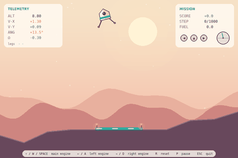
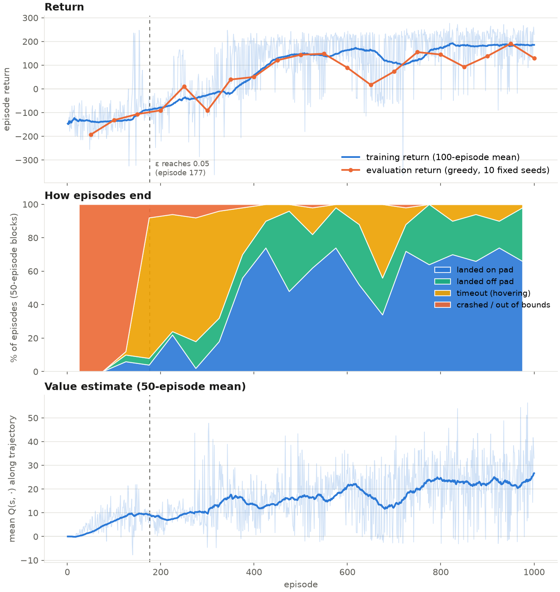

# LanderRL

Deep Q-learning on a 2-D lunar lander, with the simulator written from scratch.

The environment (`lander/`) is pure Python with no third-party dependencies, so every
term of the observation, the reward and the termination rules is in plain sight and can be
changed. The agent (`dqn/`) is a standard DQN (Mnih et al., 2015) in PyTorch. On a laptop CPU
it goes from random flailing to landing on the pad in roughly 500 episodes / three minutes.

<table>
<tr>
<td align="center"><br><sub>untrained (random policy)</sub></td>
<td align="center"><br><sub>episode 150 - avoids the ground, hovers until timeout</sub></td>
</tr>
<tr>
<td align="center"><br><sub>episode 450 - first pad landings, slow and hesitant</sub></td>
<td align="center"><br><sub>episode 950 (best eval) - direct descent, lands in 437 steps</sub></td>
</tr>
</table>

<sub>All four clips use the same seed (identical terrain and initial state).</sub>

## Quick start

```bash
python -m venv .venv && .venv/bin/pip install -r requirements.txt
.venv/bin/pip install torch --index-url https://download.pytorch.org/whl/cpu   # if no GPU

.venv/bin/python train.py                                   # 1000 episodes -> runs/<timestamp>/
.venv/bin/python play.py --checkpoint runs/dqn-v1/checkpoints/best.pt   # watch a trained agent
.venv/bin/python play.py                                    # fly it yourself
.venv/bin/python tests/test_env.py && .venv/bin/python tests/test_dqn.py
```

Keys in the viewer: `↑`/`W`/`Space` main engine, `←`/`A` left, `→`/`D` right, `R` reset, `P` pause, `Esc` quit.

## Environment

The lander is a single rigid body under gravity with a main engine through the centre of mass
and two side engines mounted above it (so they translate *and* rotate the body). Each leg is a
spring-damper point contact with Coulomb friction against a procedurally generated terrain
with a flat pad at the centre. Integration is semi-implicit Euler, 4 substeps per 1/50 s frame.
All constants live in `lander/config.py`.

**Observation** - 8 floats, normalised to roughly [-1, 1]:

| i | quantity | definition |
|---|---|---|
| 0 | horizontal offset from pad | `(x - pad_x) / (W/2)` |
| 1 | altitude above pad | `(y - pad_y - leg) / (H/2)` |
| 2, 3 | velocity | `vx / 5`, `vy / 5` |
| 4 | angle | radians, 0 = upright |
| 5 | angular velocity | rad/s |
| 6, 7 | leg contact | 0 / 1 for left, right |

**Actions** - `0` no-op, `1` left engine, `2` main engine, `3` right engine.

**Reward** per step is potential-based shaping plus a fuel cost plus a terminal bonus:

```
r_t = Φ(s_t+1) − Φ(s_t)  −  fuel(a_t)  +  terminal(s_t+1)

Φ(s) = −100·dist_to_pad − 100·speed − 100·|angle| + 10·(left_leg + right_leg)
fuel = 0.30 (main), 0.03 (side), 0 (no-op)
terminal = +100 landed on pad · +20 landed off pad · −100 crash or out of bounds
```

Because the shaping term is a difference of potentials it does not change the optimal policy
(Ng, Harada & Russell, 1999). The leg-contact term sits *inside* Φ on purpose: a leg touching
down earns +10, a leg lifting off costs −10, so the bonus cannot be farmed by bouncing. The fuel
cost is what makes hovering strictly worse than landing; without it the agent has no reason to
leave the "safe" hover it discovers early.

**Termination** - hull contact, a leg touching down faster than 3 units/s, leg over-compression,
leaving the play area (all crashes); both legs stationary for 25 consecutive steps (landed,
on or off pad); or 1000 steps (truncation - the episode ends but the agent is *not* told the
future is worth zero, see below).

## Agent

Vanilla DQN with experience replay and a hard-updated target network.

```
Q-network        8 → 128 → ReLU → 128 → ReLU → 4        (18,180 parameters, no output activation)
target           y = r + γ·(1 − done)·max_a' Q_target(s', a')
loss             Huber(Q_online(s, a) − y),  δ = 1
optimiser        Adam, lr 5e-4, gradient-norm clip 10
```

| hyperparameter | value | | hyperparameter | value |
|---|---|---|---|---|
| γ | 0.99 | | replay buffer | 100 000 |
| batch size | 64 | | learning starts at | 1 000 transitions |
| gradient step every | 4 env steps | | target sync every | 1 000 env steps |
| ε schedule | 1.0 → 0.05, linear over 50 000 steps | | seed | 0 |

Two details that are easy to get wrong:

* `done` in the Bellman target is the *terminated* flag, never *truncated*. A timeout at step
  1000 leaves the lander mid-air with a real future; writing `done = 1` there teaches the network
  that "being alive at step 1000 is worth nothing".
* The target network is refreshed by copying weights, never by gradient. Only the online
  network's parameters are registered with the optimiser, and the target is evaluated under
  `torch.no_grad()`, so gradient flows through exactly one side of the TD error.

## Training and evaluation protocol

`train.py` runs 1000 episodes with a random initial state (horizontal offset, velocity, tilt,
spin) and fresh terrain each reset. Every episode appends a row to `train_log.csv` (return,
length, outcome, fuel, ε, mean loss, mean Q along the trajectory, rolling 100-episode return
and pad rate). Every 50 episodes the greedy policy (ε = 0) is evaluated on the same 10 fixed
seeds and logged to `eval_log.csv`; a checkpoint is written every 150 episodes and whenever the
evaluation return improves.

Loss is logged but is not used as a progress signal: the regression targets move as the network
learns, so loss can rise while the policy improves. Progress is read from the outcome
distribution and the evaluation return.

## Results

Run `runs/dqn-v1` (seed 0, CPU, 184 s wall-clock, 532k environment steps).

| episodes | mean return | crash | timeout | off pad | **on pad** |
|---|---|---|---|---|---|
| 1-100 | −136 | 100 % | 0 % | 0 % | 0 % |
| 101-200 | −78 | 48 % | 43 % | 4 % | 5 % |
| 201-300 | −27 | 7 % | 72 % | 9 % | 12 % |
| 301-400 | +58 | 3 % | 46 % | 14 % | 37 % |
| 401-500 | +146 | 0 % | 7 % | 32 % | 61 % |
| 601-700 | +109 | 0 % | 28 % | 29 % | 43 % |
| 901-1000 | **+186** | 0 % | 6 % | 24 % | **70 %** |

Greedy evaluation (10 fixed seeds) at selected checkpoints:

| episode | 150 | 300 | 450 | 600 | 750 | 900 | **950** | 1000 |
|---|---|---|---|---|---|---|---|---|
| mean return | −106 | −92 | 121 | 89 | 155 | 138 | **191** | 130 |
| pad rate | 0.0 | 0.0 | 0.5 | 0.4 | 0.7 | 0.3 | **0.6** | 0.4 |
| crash rate | 0.0 | 0.3 | 0.0 | 0.0 | 0.0 | 0.0 | 0.0 | 0.0 |



### Observations

1. **Three distinct phases.** Random policy → crash every time (ep. 1-100). Then the agent
   learns that the ground is dangerous and stops touching it: crashes vanish, but 72 % of
   episodes now end by timeout with the lander hovering (ep. 200-300). Only afterwards does
   the −0.30/step fuel cost accumulate enough to push it into committing to a landing.
   The hover phase is the direct consequence of a −100 crash penalty being ~300× larger than
   the per-step cost of doing nothing.

2. **Exploration ends early.** ε hits its floor at episode 177 because episodes lengthened to
   1000 steps during the hover phase. Most of the improvement from −27 to +186 therefore
   happened at ε = 0.05, i.e. driven by the shaping gradient rather than by exploration.

3. **Instability around episodes 600-700.** Training return dropped from +164 to +109 and the
   evaluation pad rate fell to 0.0 at episode 650 before recovering. This is the familiar DQN
   failure mode: a target-network refresh with slightly worse weights shifts every regression
   target at once. Double DQN and soft (Polyak) target updates exist specifically to damp this.

4. **Off-pad landings persist** at about a quarter of episodes. The agent is settling for the
   +20 off-pad bonus rather than spending fuel to reach the +100. A larger distance weight in Φ,
   a smaller off-pad bonus, or simply longer training would all be reasonable next experiments.

5. **Value estimates stay sane.** Mean Q along trajectories climbs from 0 to ~25 and tracks the
   return. It sits below the mean return because it averages over all four actions at every
   visited state; no sign of the unbounded over-estimation that plain DQN can exhibit.

6. **Evaluation on 10 seeds is noisy.** Consecutive evaluation pad rates swing 0.3 → 0.7 → 0.3
   with no corresponding change in training statistics; 30-50 seeds would be needed for the
   evaluation curve to be trusted on its own.

## Repository layout

```
lander/config.py     LanderConfig - every tunable constant
lander/terrain.py    procedural hills with a flat central pad
lander/physics.py    rigid body, engines, leg contacts, crash tests
lander/env.py        LanderEnv (reset / step / snapshot), reward, termination
dqn/network.py       QNetwork and Hyperparams
dqn/replay.py        ReplayBuffer (pre-allocated ring, uniform sampling)
dqn/agent.py         DQNAgent - ε-greedy action, TD loss, target sync, save / load
train.py             training loop, CSV logging, periodic evaluation, checkpoints
play.py              pygame viewer: keyboard control or --checkpoint replay
scripts/record.py    headless episode → GIF (used for the clips above)
scripts/plot.py      learning curves from a run's CSV logs
ui/                  renderer and interactive loop (pygame); never imported by lander/ or dqn/
tests/               environment tests (incl. a scripted autopilot) and DQN unit tests
runs/dqn-v1/         logs and checkpoints of the run reported here
```

`lander` never imports `ui` or `dqn`, and `dqn` never imports `ui`, so the trainer runs without a
display and the viewer can host any `obs -> action` callable.

